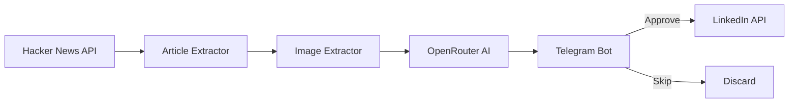

<div align="center">

# 🔥 HNLINK

### Turn Hacker News into LinkedIn Virality — On Autopilot

<p>
  <strong>Discover trending Hacker News stories, transform them into engaging LinkedIn posts with AI, review them in Telegram, and publish with a single tap.</strong>
</p>

[](https://python.org)
[](https://core.telegram.org/bots)
[](https://developer.linkedin.com)
[](https://openrouter.ai)
[](LICENSE)
[](https://huggingface.co/spaces)

<p>
<a href="#-features">Features</a> •
<a href="#-how-it-works">Workflow</a> •
<a href="#-getting-started">Getting Started</a> •
<a href="#-deployment">Deployment</a> •
<a href="#-faq">FAQ</a>
</p>

> **Stop writing LinkedIn posts manually. Let AI do the boring part. You just approve and publish.**

---


</div>

---

# 💡 Why HNLINK?

Every day, Hacker News surfaces some of the best discussions in tech.

You read an article, think *"I should post about this on LinkedIn,"* then spend the next 20 minutes:

* Writing a hook
* Rewriting paragraphs
* Finding hashtags
* Looking for an image
* Editing the formatting
* Wondering whether it's good enough

Eventually you either publish something average...

...or don't publish anything at all.

**HNLINK automates everything except the final decision.**

You stay in control while AI handles the repetitive work.

---

# ✨ Features

* 🔥 Fetch trending Hacker News stories
* 📖 Extract complete article content
* 🖼 Automatically download the featured image
* 🤖 Generate high-quality LinkedIn posts with AI
* 📱 Review posts inside Telegram
* ✅ One-tap approval workflow
* 💼 Publish directly to LinkedIn
* 🚫 Prevent duplicate posts with SQLite history
* ⚡ Powered by OpenRouter
* 🐳 Docker ready
* ☁️ Free deployment on Hugging Face Spaces

---

# 🚀 What Happens?

```text
1. Fetch Hacker News
        │
        ▼
2. Extract Article + Image
        │
        ▼
3. AI Writes LinkedIn Post
        │
        ▼
4. Send to Telegram
        │
   ┌────┴────┐
   │         │
Approve    Skip
   │         │
   ▼         ▼
LinkedIn   Archive
```

---

# ⚙️ How It Works



---

# 🧠 Why The AI Output Works

HNLINK isn't just summarizing articles.

It follows a repeatable structure designed for professional social media.

Every generated post includes:

* 🎣 Attention-grabbing opening hook
* 📖 Short readable paragraphs
* 🧠 Key insights instead of article summaries
* 📈 Three-level hashtag strategy
* 💬 Conversation-starting ending
* 🚫 No Markdown
* 🚫 No URLs
* 📸 Original article image

The result is content that's ready to paste directly onto LinkedIn.

---

# 📸 Example Output

```
Most developers are optimizing the wrong thing.

A Hacker News discussion today highlighted a startup that
reduced infrastructure costs by nearly 80%.

Not by switching cloud providers.

Not by adding more engineers.

They simply questioned one assumption everyone else accepted.

Sometimes the biggest improvements come from deleting,
not adding.

What's one engineering decision you've changed your mind about recently?

#SoftwareEngineering
#Programming
#Startups
#HackerNews
```

---

# 🛠 Tech Stack

| Technology       | Purpose            |
| ---------------- | ------------------ |
| Python           | Core application   |
| OpenRouter       | AI generation      |
| Telegram Bot API | Review workflow    |
| LinkedIn API     | Publishing         |
| Hacker News API  | Story source       |
| BeautifulSoup    | Article extraction |
| Requests         | Networking         |
| SQLite           | History tracking   |
| Docker           | Deployment         |

---

# 🚀 Getting Started

## Requirements

* Python 3.10+
* OpenRouter API Key
* LinkedIn Developer App
* Telegram Bot
* LinkedIn Access Token

---

## Installation

```bash
git clone https://github.com/Lumacodes/HNLINK.git

cd HNLINK

python -m venv .venv

source .venv/bin/activate

pip install -r requirements.txt
```

---

## Configuration

```bash
cp .env.example .env
```

Fill the environment variables.

```env
OPENROUTER_API_KEY=sk-or-...

LINKEDIN_ACCESS_TOKEN=your_token

LINKEDIN_PERSON_URN=urn:li:person:xxxxxxxx

TELEGRAM_BOT_TOKEN=xxxxxxxx

TELEGRAM_CHAT_ID=xxxxxxxx
```

---

## Environment Variables

| Variable              | Required | Description           |
| --------------------- | -------- | --------------------- |
| OPENROUTER_API_KEY    | ✅        | OpenRouter API key    |
| LINKEDIN_ACCESS_TOKEN | ✅        | LinkedIn OAuth token  |
| LINKEDIN_PERSON_URN   | ✅        | LinkedIn profile URN  |
| TELEGRAM_BOT_TOKEN    | ✅        | Telegram Bot token    |
| TELEGRAM_CHAT_ID      | ✅        | Chat ID for approvals |

---

## Run

```bash
python src/telegram_bot.py
```

Open Telegram.

```
/fetch
```

Within a few seconds you'll receive generated posts with:

✅ Approve

❌ Skip

Approve publishes immediately.

Skip permanently ignores the story.

---

# 📱 Telegram Commands

| Command    | Description                |
| ---------- | -------------------------- |
| `/start`   | Display available commands |
| `/fetch`   | Generate 3 LinkedIn posts  |
| `/fetch 5` | Generate 5 posts           |
| `/status`  | Check APIs and bot health  |
| `/history` | View posting statistics    |
| `/help`    | Show command reference     |

---

# 📂 Project Structure

```text
HNLINK/
│
├── src/
│   ├── telegram_bot.py
│   ├── hn_fetcher.py
│   ├── content_extractor.py
│   ├── post_generator.py
│   ├── linkedin_poster.py
│   └── history_tracker.py
│
├── config/
│   └── settings.py
│
├── scripts/
│   └── run_pipeline.py
│
├── assets/
│   └── demo.gif
│
├── Dockerfile
├── requirements.txt
└── README.md
```

---

# ☁️ Deployment

## Hugging Face Spaces (Recommended)

1. Fork this repository
2. Create a Docker Space
3. Add environment variables as Secrets
4. Push your code

Your bot stays online 24/7 for free.

---

## Docker

```bash
docker build -t hnlink .

docker run --env-file .env hnlink
```

---

# 🎯 Perfect For

* Software Engineers
* Indie Hackers
* Startup Founders
* DevRel Teams
* Technical Writers
* AI Content Creators
* Open Source Maintainers

---

# 🗺 Roadmap

* [ ] Reddit support
* [ ] Product Hunt support
* [ ] RSS feeds
* [ ] Multi-language generation
* [ ] Multiple LinkedIn accounts
* [ ] Scheduled publishing
* [ ] Analytics dashboard
* [ ] Custom AI prompts
* [ ] Team collaboration
* [ ] Web dashboard

---

# 🤝 Contributing

Contributions are welcome.

If you have an idea, bug fix, or feature request:

1. Fork the repository
2. Create a feature branch
3. Commit your changes
4. Open a Pull Request

Every contribution is appreciated.

---

# ❓ FAQ

### Is OpenRouter free?

Yes.

The free tier is enough for testing and light usage.

---

### Does HNLINK publish automatically?

No.

Every generated post must be approved inside Telegram.

---

### Can I use another AI model?

Yes.

Any model available through OpenRouter can be used.

---

### Can I customize the prompt?

Absolutely.

Simply edit the prompt inside `post_generator.py`.

---

### Does it repost the same article?

No.

Published stories are stored in SQLite to prevent duplicates.

---

# 📄 License

Released under the MIT License.

Use it for personal or commercial projects.

---

<div align="center">

## ⭐ Support the Project

If HNLINK saves you time or helps you stay consistent on LinkedIn, consider giving the repository a star.

It helps more developers discover the project.

<p>

<a href="https://github.com/Lumacodes/HNLINK">

</a>

<a href="https://ko-fi.com/lumacodes">

</a>

</p>

### Built with ☕, Python, and too much time spent reading Hacker News.

**Made by [Luma](https://github.com/Lumacodes)**

</div>
